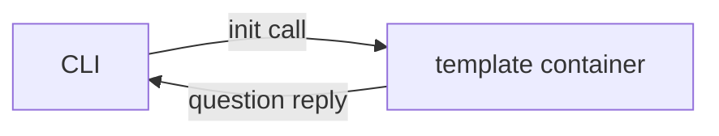

## Diagram

A plain `mermaid` code block. LLMs read mermaid well, so it reaches them unchanged.

```mermaid
flowchart LR
  CLI -- "init call" --> TC["template container"]
  TC -- "question reply" --> CLI
```
