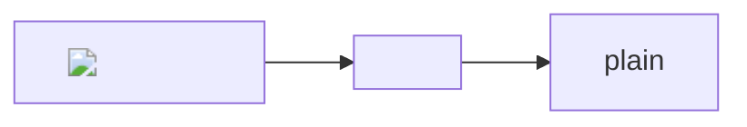

```mermaid
%%{init: {"securityLevel": "loose", "startOnLoad": true}}%%
flowchart LR
  A["<img src=x onerror=alert(1)>"] --> B["<script>alert(2)</script>"]
  B --> C[plain]
  click A call alert(3)
  click C "javascript:alert(4)"
```
